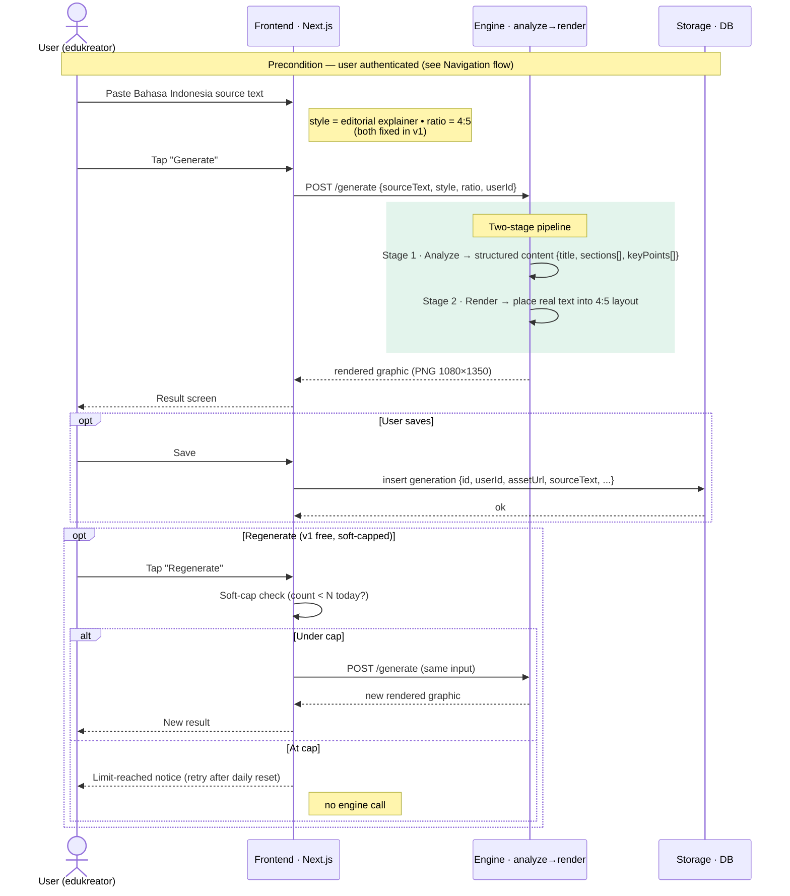
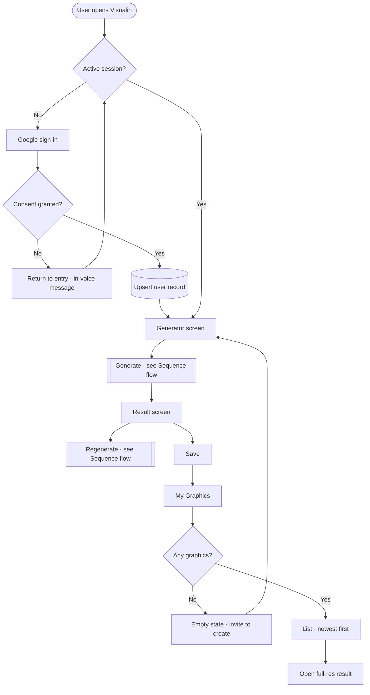

# AppFlow — Visualin

| | |
|---|---|
| **Phase** | P1 · PRD + AppFlow (Product Owner) |
| **Status** | 🟡 Draft — pending approval to gate into P2 |
| **Scope** | **v1 only.** Later-version flows (payments, extra inputs, brand kit) are out. |
| **Companion** | `PRD.md` (requirements) |

Two diagrams, each doing the job it's best at: a **sequence diagram** for the core generate/regenerate interaction (the request/response timing that defines the API contract), and a **navigation flowchart** for how a user moves through screens. Both are Mermaid — text, git-diffable, and they render in GitHub and most Markdown viewers.

*(The earlier HTML swimlane has been retired in favour of these; a swimlane blurs the time axis and is heavier to maintain across P2–P7.)*

---

## 1. Primary — Generation sequence (Flows B + C)

The core of v1: a request to a **two-stage engine** and back. This diagram is also the source of truth for the `/generate` contract.

**Why stage 1 → stage 2 is drawn explicitly:** stage 2 places *real text*, so Bahasa Indonesia renders legibly by construction. This is the make-or-break assumption designed into the flow (`PRD.md` §5.2). The self-messages on `EN` are placeholders for the internal pipeline — P2 decides whether both stages are one service or two.

---

## 2. Navigation (Flows A + D)

Where the user goes: the auth gate, the generator, save, and the My Graphics screen with its empty state.

---

## 3. Flow narratives

**Flow A — Auth & entry.** User opens Visualin → Frontend checks session. No session → Google sign-in; on consent, Storage upserts the user record and the generator opens. Cancelled OAuth returns to entry with an in-voice message; no account is created.

**Flow B — Generate (happy path).** Style (*editorial explainer*) and ratio (*4:5*) are fixed and read-only in v1. User pastes Bahasa Indonesia text (empty/whitespace keeps **Generate** disabled; over-limit is blocked with the limit stated) and taps **Generate**. The Engine runs **Analyze** then **Render**, both surfaced to the user, and returns the graphic to the Result screen. On failure: in-voice error + retry, input preserved.

**Flow C — Regenerate (the one v1 branch).** From the Result screen, **Regenerate** re-runs on the same input after a **soft-cap check** (`count < N today?`). Under cap → re-run engine → new result (count increments). At cap → limit notice, **no engine call**. Free in v1; credit *deduction* arrives in v3 — same checkpoint, different consequence.

**Flow D — Save & view.** **Save** inserts a generation record. **My Graphics** lists the user's graphics newest-first; opening one shows full-res. Empty list → an invitation to create, not a blank screen.

---

## 4. Entity glossary

| Entity | Shape | Passed |
|---|---|---|
| **user profile** | `{ id, email, name }` | Auth → Storage (Flow A) |
| **source text** | Bahasa Indonesia string (bounded length) | User → Frontend (Flow B) |
| **generation request** | `{ sourceText, style:"editorial-explainer", ratio:"4:5", userId }` | Frontend → Engine (Flow B) |
| **structured content** | `{ title, sections[], keyPoints[] }` | Engine stage 1 → stage 2 |
| **rendered graphic** | image asset · PNG · 1080×1350 | Engine → Frontend (Flow B) |
| **generation record** | `{ id, userId, assetUrl, sourceText, style, ratio, createdAt }` | Frontend → Storage (Flow D) |
| **graphics list** | `graphics[]`, newest first | Storage → Frontend (Flow D) |

> Field names are indicative for P2/P4, not a locked schema — the schema is decided in **P4**. They exist here so the generation contract between Frontend, Engine, and Storage is explicit before stack selection.

---

**Phase gate:** on approval, `PRD.md` + `AppFlow.md` complete → **P1 done**, ready for **P2 · TechStack**.
